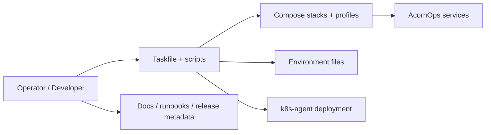
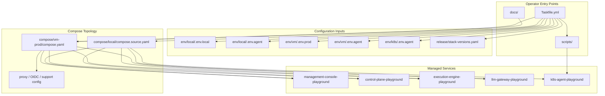

# Deployment Repository Architecture

For the whole-system service topology, use the workspace-level
[System Architecture](../docs/system-architecture.md). For deployment-specific
topology, use [docs/deployment-architecture.md](docs/deployment-architecture.md).
This file documents only the deployment repository's internal ownership and
structure.

The deployment repository is the distribution and operations layer for:

1. local full-stack bring-up
2. Docker-on-VM production deployment
3. Kubernetes cluster-agent rollout automation
4. environment and profile management by deployment track
5. release compatibility metadata

## High-Level Diagram

## Detailed Diagram

## Primary Responsibilities

1. define the supported deployment tracks and compose profiles
2. centralize stack env templates, operational scripts, and runbooks
3. wire the six repositories into a runnable local or production-like stack
4. manage version compatibility expectations for image-based deployments
5. keep cluster-agent deployment separate from the central service lifecycle
