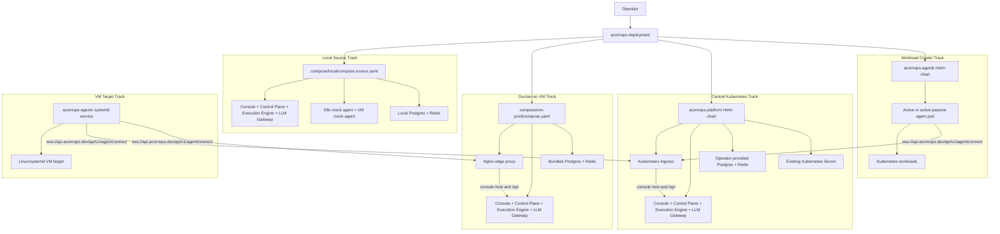

# AcornOps Deployment Architecture

This document describes how the deployment repository assembles and exposes the
AcornOps platform. For the whole-platform service model, start from the
workspace-level architecture at `../docs/system-architecture.md` when this
repository is checked out through the `acornops` workspace from the repository root,
or `../../docs/system-architecture.md` from this docs directory.

Component repositories own service internals. This repository owns the
deployment tracks, environment templates, ingress/proxy wiring, platform Helm
chart, release compatibility metadata, and operator runbooks.

## Deployment Topology

## Deployment Tracks

Local source development runs all core services together with local state,
source bind mounts, and deterministic mock targets. Use it when developing
cross-service behavior and validating the full stack locally.

Docker-on-VM production deployment packages the central services behind the
Nginx edge proxy and includes bundled Postgres and Redis state. It is the
single-host production-like track.

Central Kubernetes deployment installs the management console, control plane,
execution engine, and LLM gateway through the platform Helm chart. It expects
operator-provided Postgres and Redis, pre-created secrets, and cluster ingress
configuration.

Workload-cluster agent rollout installs the AgentK into target clusters. The
agent connects outbound to the control plane and can run active-passive HA with
Kubernetes Lease leader election.

VM target rollout installs versioned AgentV releases as an unprivileged
Linux/systemd service. It connects outbound and reports bounded diagnostics.
The optional root-owned action socket remains disabled until an operator
installs an exact service allowlist. The AgentV container remains read-only.

## Public And Internal Boundaries

Production public route hostnames:

- `console.acornops.dev/` serves the management console.
- `api.acornops.dev/api` serves the control plane API and agent WebSocket route.
- `console.acornops.dev/api` remains available for same-origin browser session flows.
- `docs.acornops.dev/` serves the public documentation site.

The root `acornops.dev` domain is reserved for future marketing or redirect
ownership outside the platform API surface. The docs site is not served by the
VM Compose stack or Kubernetes platform chart.

Internal-only services:

- execution-engine
- llm-gateway
- Postgres
- Redis

## Runtime State

Control-plane Postgres stores durable application state such as workspaces,
targets, sessions, runs, and persisted run events. Control-plane Redis handles
runtime coordination, including agent ownership, cross-pod command routing, run
event fanout, and scheduler leases.

LLM gateway Postgres stores gateway-owned metadata, and gateway Redis supports
gateway runtime coordination. Production Kubernetes deployments provide these
state services externally; VM Compose includes bundled state services.

## HA Notes

- management console, control-plane, execution-engine, and llm-gateway can
  default to three Kubernetes replicas.
- control-plane HA depends on external Redis for agent ownership, cross-pod
  command routing, run event fanout, and renewed scheduler leases.
- agentk supports active-passive HA through Kubernetes Lease leader election;
  it is not active-active.
- AgentV availability is tied to the managed VM host and systemd service
  health.
